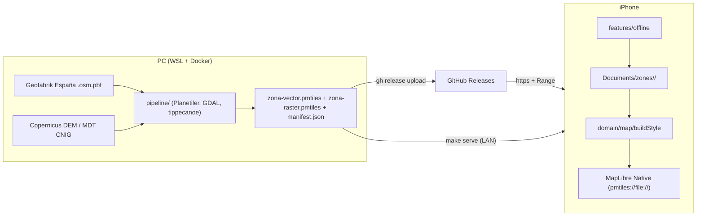
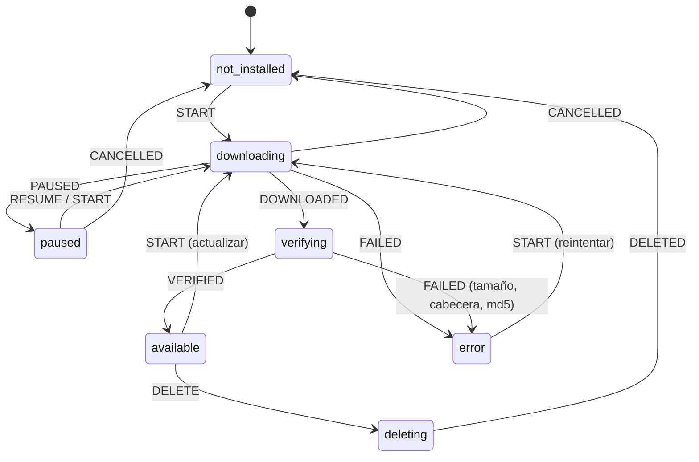

# Arquitectura (M0–M2)

App Expo (React Native, New Architecture) sin backend. El mapa funciona **solo con ficheros locales**: la red se usa únicamente para descargar el catálogo y las zonas.



## Capas del código

| Carpeta                | Qué contiene                                                                                                                                                                              | Puede importar                                 |
| ---------------------- | ----------------------------------------------------------------------------------------------------------------------------------------------------------------------------------------- | ---------------------------------------------- |
| `app/`                 | Rutas de expo-router. Solo re-exportan pantallas.                                                                                                                                         | `features/`                                    |
| `src/features/<área>/` | Pantallas, hooks y estado de cada funcionalidad (`map`, `offline`, `legend`, `settings`, `signature`).                                                                                    | todo lo de abajo                               |
| `src/ui/`              | Componentes visuales genéricos y tema.                                                                                                                                                    | React Native                                   |
| `src/platform/`        | Envoltorios finos de APIs nativas: ficheros, descargas, ubicación, red, keep-awake, assets del mapa, info del build. Es lo que se simula en los tests.                                    | Expo / RN                                      |
| `src/domain/`          | TypeScript puro: validación del manifest, máquina de estados de zona, reconciliación con disco, verificación de ficheros, estilo del mapa, espacio libre, caducidad de la firma, ajustes. | nada de React/Expo/MapLibre (lo impone ESLint) |
| `src/i18n/`            | Textos es/en (el español es la referencia de claves).                                                                                                                                     | i18next                                        |
| `src/lib/`             | Utilidades transversales (logger).                                                                                                                                                        | —                                              |
| `pipeline/`            | Generación de zonas en Docker (Python + herramientas GIS). Independiente de la app.                                                                                                       | —                                              |

Reglas:

- La lógica que se pueda expresar sin APIs nativas va en `domain/` y se prueba en Node.
- `features/` orquesta: p. ej. `features/offline/zoneDownload.ts` recibe sus dependencias (`DownloadDeps`) para poder probar la descarga sin sistema de ficheros real.
- El contrato entre pipeline y app es doble: `docs/manifest.example.json` (lo validan Zod y pytest) y [`docs/tile-schema.md`](tile-schema.md) (capas y propiedades de las teselas).

## Almacenamiento

Sin base de datos hasta M3. El sistema de ficheros es la fuente de verdad:

```text
Documents/
  settings.json            ajustes (Zod, valores por defecto si está corrupto)
  manifest-cache.json      última copia válida del catálogo (para listar sin red)
  map-assets/glyphs/…      fuentes .pbf copiadas del bundle en el primer arranque
  zones/<id>/
    zone.json              registro de la zona instalada (solo existe si se verificó)
    download.json          descarga pendiente: fichero en curso + resumeData de la pausa
    vector.pmtiles         activos
    raster.pmtiles
    *.pmtiles.download     descarga en curso (no los usa el mapa)
```

- Al arrancar, `features/offline/localZones.ts` reconstruye el estado: una zona está **disponible** solo si `zone.json` dice `verified` y el tamaño de cada fichero coincide (`domain/zoneRecord.reconcileZone`).
- Una actualización se descarga a `*.download`; la versión instalada sigue funcionando hasta que la nueva se verifica y se sustituye.
- `Documents` entra en la copia de iCloud y expo-file-system no permite excluirlo (ver ADR 0005).

## Ciclo de vida de una zona

`domain/zoneState.ts` es una función pura; las transiciones no válidas no cambian el estado.



Verificación (`domain/verifyFile.ts`), de barata a cara: tamaño exacto → cabecera PMTiles v3 (tipo de tesela y que no esté truncado) → md5 nativo.

## Mapa

- `domain/map/buildStyle.ts` genera el estilo MapLibre a partir de las zonas instaladas: fuentes `pmtiles://file://…`, glyphs locales `file://…/{fontstack}/{range}.pbf`, mundo de bajo zoom en GeoJSON (Natural Earth) embebido. **No hay ninguna URL http en el estilo** (lo comprueba un test).
- Con varias zonas las capas se intercalan por grupo (fondos de todas, luego curvas de todas, …, etiquetas de todas).
- El mapa se remonta (`key`) cuando cambian las zonas o su versión, para que MapLibre vuelva a abrir los PMTiles.

## GPS (M1–M2)

Solo primer plano (`expo-location` `watchPositionAsync`, permiso "Mientras se usa"). La precisión horizontal y vertical se muestran siempre junto al dato. El tracking en segundo plano se decidirá en M3 (spike S7, módulo nativo).

## Seguridad

- Sin secretos ni cuentas. `EXPO_PUBLIC_MANIFEST_URL` es pública.
- Todo lo externo se valida: manifest y ajustes con Zod, propiedades de teselas normalizadas antes de mostrarlas (`domain/map/featureInfo.ts`), ids de zona con regex (se usan en rutas de fichero).
- URLs de datos: solo `https`, o `http` hacia IPs privadas para el servidor de pruebas (`domain/manifest.isAllowedDataUrl`, `NSAllowsLocalNetworking`).
- Los logs redondean coordenadas (`lib/logger.redactCoordinate`).
